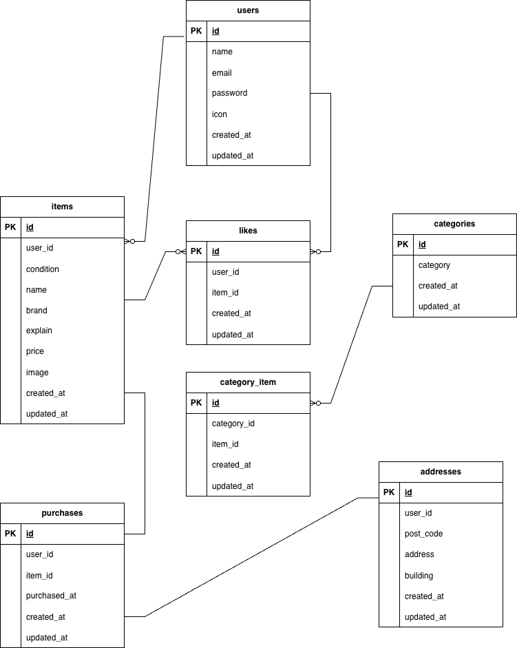

# プロジェクト名

coachtechフリマ

# 概要

商品の出品・購入ができるフリマアプリです。
利用には会員登録が必要です。

## 環境

- php バージョン: 8.1
- Laravel バージョン: 8.83
- データベース: MySQL(Docker使用)

## セットアップ手順

1. このリポジトリをクローン
```bash
git clone git@github.com:haruna-satoh/case01.git
cd case01
```

2. Dockerを起動
```bash
docker compose up -d --build
```

3. .envファイルを作成
```bash
cp src/.env.example src/.env
```

4. Laravelアプリケーションのセットアップ
php コンテナ内で実行
```bash
docker compose exec php bash
composer install
php artisan key:generate
php artisan migrate --seed
```

## Stripe設定

1. https://dashboard.stripe.com/ にログイン
2. Developers(開発者) → API keys
3. テストキーを取得
4. .env に設定

STRIPE_KEY=取得した公開キー
STRIPE_SECRET=取得した秘密キー

*テストモードを使用しています


## ER図
アプリ内で使用しているテーブル構成を示したER図です。



## テスト手順
MySQL コンテナ内で実行
```bash
docker compose exec mysql bash
mysql -u root -p
root
CREATE DATABASE demo_test;
exit;
exit
```
※パスワードは.env.testingに記載しているものを使用してください

php コンテナ内で実行
```bash
docker compose exec php bash
php artisan migrate --env=testing
php artisan test
```
テスト結果がすべての項目でPASSであれば、基本動作が正常であると確認できます。

## URL

- [http://localhost](http://localhost)
    →トップページが表示されます
- [http://localhost/register](http://localhost/register)
    →会員登録ページが表示されます
- [http://localhost:8080/](http://localhost:8080/)
    →phpMyAdminが表示され、DBを確認できます